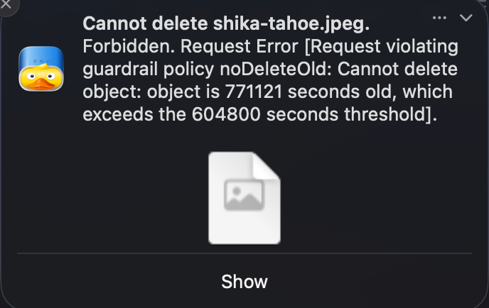

# S3Broker

[](https://www.npmjs.com/package/s3broker)
[](https://opensource.org/licenses/MIT)

A Cloudflare Workers library for building S3 proxies with guardrails.

[](https://deploy.workers.cloudflare.com/?url=https://github.com/tsunrise/s3broker-template)

## Overview

S3Broker is a TypeScript library for building proxies and guardrails for S3-compatible storage. The library is intended to be used on Cloudflare Workers.

When you have an S3 secret key with read/write access, any client using that key can perform destructive operations. Your data is vulnerable to:

- **Accidental deletion** by users or misconfigured tools
- **Ransomware attacks** that encrypt or delete your files

S3Broker acts as a protective layer between your clients and the upstream S3 endpoint. Instead of giving clients direct access to your upstream key (Key B), you give them a different key (Key A). S3Broker validates every request against configurable guardrails and blocks dangerous operations before they reach your storage.

```
==========              ============             ============
||Client|| -- Key A --> ||S3Broker|| -- Key B --> ||Upstream||
==========              ============             ============
```

Example of triggering a guardrail violation using Mountain Duck:



## Installation

```bash
npm install s3broker
```

## Quick Start

### Basic Usage (With Default Guardrails)

```typescript
import { handle } from 's3broker';

export default {
	async fetch(request, env, ctx) {
		return handle(request, {
			s3Endpoint: env.S3_ENDPOINT,
			clientAccessKeyId: env.CLIENT_ACCESS_KEY_ID,
			clientSecretAccessKey: env.CLIENT_SECRET_ACCESS_KEY,
			upstreamAccessKeyId: env.UPSTREAM_ACCESS_KEY_ID,
			upstreamSecretAccessKey: env.UPSTREAM_SECRET_ACCESS_KEY,
		});
	},
};
```

## With Custom Guardrails

Example: Reject requests deleting/replacing files older than 1 hour unless the file has path prefix `/frequent_updated/`.

```typescript
import { handle } from 's3broker';

export default {
	async fetch(request, env, ctx) {
		return handle(request, ctx, {
			s3Endpoint: env.S3_ENDPOINT,
			clientAccessKeyId: env.CLIENT_ACCESS_KEY_ID,
			clientSecretAccessKey: env.CLIENT_SECRET_ACCESS_KEY,
			upstreamAccessKeyId: env.UPSTREAM_ACCESS_KEY_ID,
			upstreamSecretAccessKey: env.UPSTREAM_SECRET_ACCESS_KEY,
			guardrailConfig: {
				noDeleteOld: [
					{
						pattern: '/frequent_updated/.*',
						config: null,
					},
					{
						pattern: '/.*',
						config: { noDeleteBeforeSeconds: 3600 },
					},
				],
				noReplaceOld: [
					{
						pattern: '/frequent_updated/.*',
						config: null,
					},
					{
						pattern: '/.*',
						config: { noReplaceBeforeSeconds: 3600 },
					},
				],
			},
		});
	},
};
```

### Pattern Syntax

Patterns use regex syntax with the following rules:

- **Full path matching**: Patterns are matched against the entire path (automatically anchored with `^` and `$`)
- **Auto-prepend `/`**: If a pattern doesn't start with `/`, it will be automatically prepended
- **Do NOT include anchors**: Do not include `^` at the start or `$` at the end — they are added automatically and will cause an error if included

**Examples:**

| Pattern          | Matches                                | Does NOT Match               |
| ---------------- | -------------------------------------- | ---------------------------- |
| `/bucket/tom/.*` | `/bucket/tom/file.txt`                 | `/bucket/alpha/tom/file.txt` |
| `/free/.*`       | `/free/anything`                       | `/notfree/anything`          |
| `bucket/.*`      | `/bucket/file.txt` (auto-prepends `/`) | —                            |

### Built-in Policies

#### `noDeleteOld`

Prevents deletion of objects unless they were created recently (within `noDeleteBeforeSeconds`).

- Blocks single object DELETE requests for old objects
- **Completely blocks bulk delete (POST ?delete)** in protected paths (since checking each object's age is not feasible)

#### `noReplaceOld`

Prevents replacement of objects unless they were created recently (within `noReplaceBeforeSeconds`).

- Blocks PUT requests that would replace old objects
- **Blocks POST uploads** (browser-based form uploads) that would replace old objects

#### `managedSse`

Automatically injects SSE-C (Server-Side Encryption with Customer-Provided Keys) headers for PUT/GET/HEAD requests. This enables seamless encryption without requiring clients to manage encryption keys.

- If the client provides their own SSE headers, those are passed through (not overwritten)
- For GET requests to unencrypted legacy files, the proxy will automatically retry without SSE headers
- Configuration requires a base64-encoded 256-bit (32-byte) AES key

```typescript
managedSse: [
  {
    pattern: '/bucket/encrypted/.*',
    config: { key: 'base64-encoded-32-byte-key' },
  },
],
```

## Limitations

- **`STREAMING-AWS4-HMAC-SHA256-PAYLOAD`** payload signing method is not supported. Use unsigned payloads or standard SHA256 signing instead.

## About this repository

The repo is structured as a monorepo with the following packages:

- `s3broker` (at `packages/s3broker`): The main library published to npm, living in `packages/s3broker`.
- `s3broker-worker` (at root path): A Cloudflare Worker for the author to test the package with Cloudflare R2 S3-compatible API. You could use it as an example of how to use the library. Note that in `package.json`, it depends on `s3broker` from the monorepo:

  ```
  {"s3broker": "workspace:*"}
  ```

  In production, you should install `s3broker` from npm instead.

### Releasing

1. Run `./scripts/release.sh` (bumps version, creates tag, pushes). Merge the release PR.
2. Go to GitHub → Releases → "Draft a new release"
3. Select your tag (e.g., 0.1.0) → Publish release
4. Workflow triggers automatically and publishes to npm

## License

MIT
